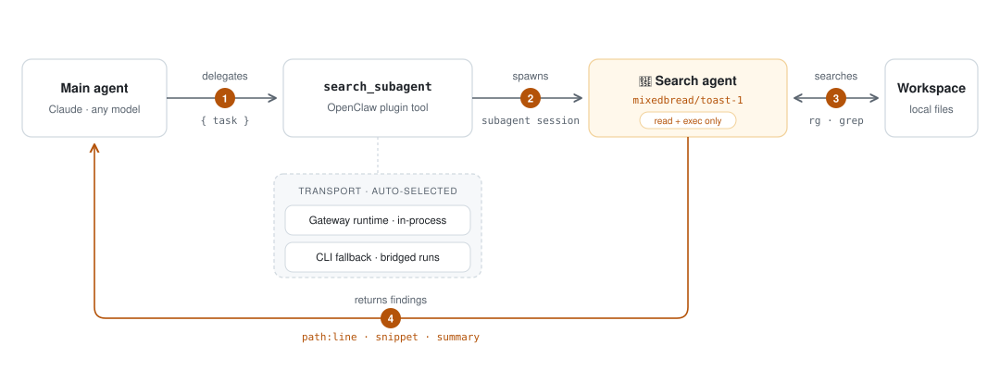

# @mixedbread/openclaw-search-subagent

An [OpenClaw](https://openclaw.ai) plugin that turns [Mixedbread](https://mixedbread.com)'s
**Toast-1** model into a local-search subagent. It registers two things:

- **`mixedbread` model provider** — Toast-1 (`mixedbread/toast-1`) via the
  OpenAI-compatible endpoint at `https://api.mixedbread.com/v1`, with API-key
  auth (`MIXEDBREAD_API_KEY`, or `openclaw models auth login`).
- **`search_subagent` agent tool** — lets any agent delegate a local file/code
  search. The tool spawns a subagent session (`agent:search:subagent:<uuid>`)
  running Toast-1, which searches the workspace with ripgrep/grep (read-only)
  and returns `path:line` findings inline to the calling agent.

Why: your main agent (e.g. Claude) stays focused while a cheap, fast,
search-specialized model does the grepping.

## How it works

<picture>
  <source media="(prefers-color-scheme: dark)" srcset="docs/how-it-works-dark.svg">
  
</picture>

The tool has two transports and picks automatically:

1. **Gateway runtime** (`api.runtime.subagent.run`) when executing inside the
   Gateway process.
2. **CLI fallback** (`openclaw agent --agent search --session-key …`) when the
   tool executes in a bridged process (e.g. the claude-cli / Claude Code MCP
   bridge), where the in-process subagent runtime is unavailable. A
   `sessions_spawn`-style child would inherit the CLI harness's tool ceiling
   and end up with no callable tools; the CLI turn does not.

## Install

```bash
openclaw plugins install clawhub:mixedbread/openclaw-search-subagent
openclaw models auth login          # pick Mixedbread → paste your API key
openclaw gateway restart
```

That's the whole setup. Install auto-enables the plugin, and the auth step
writes everything else into your config for you:

- **`tools.alsoAllow: ["search_subagent"]`** — the default `coding` tool
  profile excludes plugin tools, so the tool is allowlisted.
- **A read-only `search` agent** in `agents.list`, pinned to
  `mixedbread/toast-1` with `read` + `exec` only.
- **Model-override authorization** for fallback spawns
  (`plugins.entries.search-subagent.subagent`).

The defaults are idempotent and never overwrite your config — an existing
`search` agent or allowlist entry is left untouched. If you configure the key
another way (e.g. `MIXEDBREAD_API_KEY` in the gateway env), `openclaw doctor
--fix` applies the same defaults, and the plugin auto-enables whenever a
Mixedbread signal (env key, provider config, or a `mixedbread/*` agent model)
is present.

For a local checkout use
`openclaw plugins install --link /path/to/mixedbread-openclaw-search-subagent`
instead of the ClawHub spec.

## Configuration reference

Everything below is written automatically by the install flow; it's documented
here for customization.

### The generated config

```json5
{
  "tools": { "alsoAllow": ["search_subagent"] },
  "agents": {
    "list": [
      {
        "id": "search",
        "name": "Search",
        "description": "Read-only local search agent powered by Mixedbread Toast-1.",
        "model": "mixedbread/toast-1",
        "tools": { "allow": ["read", "exec"] }
      }
    ]
  },
  "plugins": {
    "entries": {
      "search-subagent": {
        "enabled": true,
        "subagent": { "allowModelOverride": true, "allowedModels": ["mixedbread/toast-1"] }
      }
    }
  }
}
```

The tool targets the `search` agent so subagents run with a minimal read-only
toolset. If no `search` agent exists, it falls back to the calling agent with a
`mixedbread/toast-1` model override — that's what the policy-gated
`subagent.allowModelOverride` block authorizes.

### Plugin options (all optional)

Set under `plugins.entries.search-subagent.config`:

| Key              | Default                          | Description                                          |
| ---------------- | -------------------------------- | ---------------------------------------------------- |
| `baseUrl`        | `https://api.mixedbread.com/v1`  | Mixedbread API base URL.                             |
| `apiKey`         | –                                | API key. Prefer the env var / auth login over this.  |
| `agentId`        | `search`                         | Agent the subagent runs as (when configured).        |
| `timeoutSeconds` | `180`                            | Max wait for one search run.                         |

## Use

Ask your main agent things like:

> Use the search_subagent tool with task: "Find where HTTP retries are configured and report path:line."

The tool parameters:

| Param   | Required | Description                                                    |
| ------- | -------- | -------------------------------------------------------------- |
| `task`  | yes      | Natural-language search task.                                  |
| `path`  | no       | Directory to search; defaults to the calling agent's workspace. |
| `model` | no       | Override as `provider/model`; defaults to `mixedbread/toast-1`. |

## Model

| Model                | Context | Max output | Notes                                   |
| -------------------- | ------- | ---------- | --------------------------------------- |
| `mixedbread/toast-1` | 131k    | 4096       | Search-specialized; emits reasoning.    |

## Uninstall

```bash
openclaw search-subagent teardown       # reverts the config this plugin wrote
openclaw plugins uninstall search-subagent
openclaw gateway restart
```

`teardown` (add `--dry-run` to preview) removes the tool allowlist entry, the
`search` agent (only while it still points at a mixedbread model), and the
model-override authorization. `plugins uninstall` then removes the plugin
entry, install record, and files. Left in place on purpose: your
`models.providers.mixedbread` block and stored API key, since other tools may
use them — the teardown output lists them with removal hints.

## Development

```bash
npm install
npm test          # vitest unit tests
npm run build     # tsc → dist/ (the loader runs dist/index.js)
```

Local test loop against a real gateway:

```bash
openclaw plugins install --link .
openclaw plugins enable search-subagent
npm run build && openclaw gateway restart   # rebuild + restart after every change
openclaw agent --session-key "agent:main:t-$(date +%s)" \
  -m "Use the search_subagent tool with task: 'find usages of process.env'" --json
```

## Troubleshooting

- **The agent searches itself instead of using the tool** — common when the
  main agent runs on a CLI harness (e.g. Claude Code via claude-cli), whose
  built-in Grep/Glob compete with bridged tools. The tool description already
  steers toward delegation, but the reliable fix is a routing rule in your
  workspace `AGENTS.md`, which the harness treats as authoritative:

  ```markdown
  ## Local search — MANDATORY tool routing

  You MUST use the `search_subagent` tool for ALL local file/code searches:
  finding definitions, usages, config values, patterns, and "where is X?"
  questions. NEVER use your built-in Grep/Glob or exec grep/rg for these —
  delegate to `search_subagent` and report its results. Your own search
  tools are permitted only when `search_subagent` returns an error.
  ```

- **Model can't see `search_subagent`** — add it to `tools.alsoAllow` (step 2);
  the `coding` profile excludes plugin tools by default.
- **`plugin tool name conflict (search-subagent): search_subagent`** in
  `openclaw doctor` — another enabled plugin registers the same tool name;
  disable one of them.
- **`provider/model override is not authorized for this plugin subagent run`** —
  add the `plugins.entries.search-subagent.subagent` block (step 3), or define
  the `search` agent so no override is needed.
- **Tool times out** — long no-hit searches can exceed the CLI-harness tool
  timeout; narrow the task or raise `timeoutSeconds`.
- **Provider auth** — check `openclaw models list` shows `mixedbread/toast-1`
  as `configured`, and that `MIXEDBREAD_API_KEY` is set for the gateway
  process (`env` block in `openclaw.json` or shell env).

## Security notes

- The subagent's system prompt is read-only by contract: search with
  rg/grep, never modify files. Enforce it structurally by giving the `search`
  agent only `read` + `exec` (as above).
- Never commit API keys. Use `MIXEDBREAD_API_KEY` or OpenClaw auth profiles.
